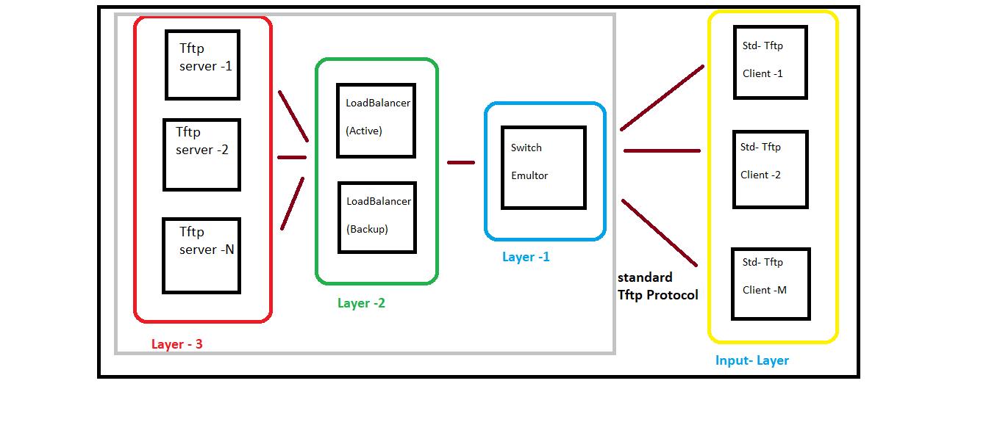

# Highly Available Distributed Tftp File Transfer System (FTS)

This project implements a **Highly Available Distributed File Transfer System** that ensures efficient and reliable file transfers through *Tftp*. The system is designed with a layered architecture for modularity and scalability.

## 📂 Project Components

The project consists of the following key components:

### 1. **TFTP Server (Layer-3)**
   - A TFTP server that handles the file transfer requests.
   - Each server is capable of serving multiple client tftp packets.

### 2. **Load Balancer (Layer-2)**
   - Distributes incoming requests to the TFTP servers efficiently.
   - Maintains fault tolerance by redistributing the load of the down server among the rest active servers.

### 3. **Switch Emulator (Layer-1)**
   - Simulates a switch that connects the clients, load balancer.
   - Switches between Active and Backup LoadBalancer.

### 4. **TFTP Client (Input-Layer)**
   - An Industry Standard TFTP client that interacts with the system to perform file transfers.
   - **Note:** Users can either use the TFTP client provided in this repository or bring their own standard TFTP client(run in octet mode).

## 🖼️ System Architecture

The complete architecture of the system is illustrated in the image below. You can find the detailed working explanation by  .

## 🚀 Features

### 1. **Highly Available**
   - No effect on the ongoing file tansfer if any one or more of the tftp servers(Layer-3) goes down
   - No effect on the ongoing file transfer if any one of the Load Balancer goes down [immediately the other takes its place]

### 2. **Highly Scalable**
   - Can serve any number of Tftp clients simultaneously
   - Can add any number of Tftp servers to the system

### 3. **Highly Modular**
   - Each instance of any Layer can be present on a unique IP
   - Following Layered Architecture increases Modularity

## 🎥 Video Demonstrations

You can view the system in action through the following videos:

1. **Smooth File Transfer even on deliberately Killing one of the tftp server instance(Layer-3)**  
   [![Load Balancer Working])](ReadMe_Utils/kill_Layer_3.mp4 "Click to watch the video")

2. **Smooth File Transfer even on deliberately Killing one of the LoadBalancer instance(Layer-2)**   
   [![Switch Emulator Working]](ReadMe_Utils/kill_Layer_2.mp4 "Click to watch the video")

3. **System in Action Without Layer-2**  
   [![Minimalistic System Working]](ReadMe_Utils/without_LB.mp4 "Click to watch the video")

> ⚠️ To play these videos, download them from the repository and use a compatible media player.

---

##  Usage

Each Project Components and their Instances can have Unique IP_Port combo but Layer-3 instances must have NFS(For fault tolerable TFTP write) 

1. **To Exe the Tftp-client (Input Layer)**
   -  cd Tftp_client folder(downloaded from here) and then do make (creates the build folder)
   -  Make a "Demo" folder at same level at build folder and keep the files for transfer here
   -  Then do cd ./build
   -  ./client_exe <SW_IP> <SW_Port> <r/w> ; r for reading files from server and w to write to server
   -  Then it will ask for file Name give ../Demo/fileName

2. **To Exe the Switch Emulator (Layer -1)**
   -  cd sw_emul folder(downloaded from here) and then do make (creates the build folder)
   -  Make a config.txt file at same level at build folder (press ./build/sw_exe enter to see format of config file)
   -  Then do cd ./build
   -  ./sw_exe <SW_PORT> <config_File_PAth>

3. **To Exe the Load Balancer (Layer-2)**
   -  cd LoadBalancer folder(downloaded from here) and then do make (creates the build folder)
   -  Make a config.txt file at same level at build folder (press ./build/lb_exe enter to see format of config file)
   -  Then do cd ./build
   -  ./lb_exe <lb_PORT> <config_File_PAth>

4. **To Exe the Tftp-server (Layer -3)**
   -  cd Tftp_server folder(downloaded from here) and then do make (creates the build folder)
   -  Make a "Demo" folder at same level at build folder and keep the files for transfer here
   -  Then do cd ./build
   -  ./server_exe <Server_Port>
